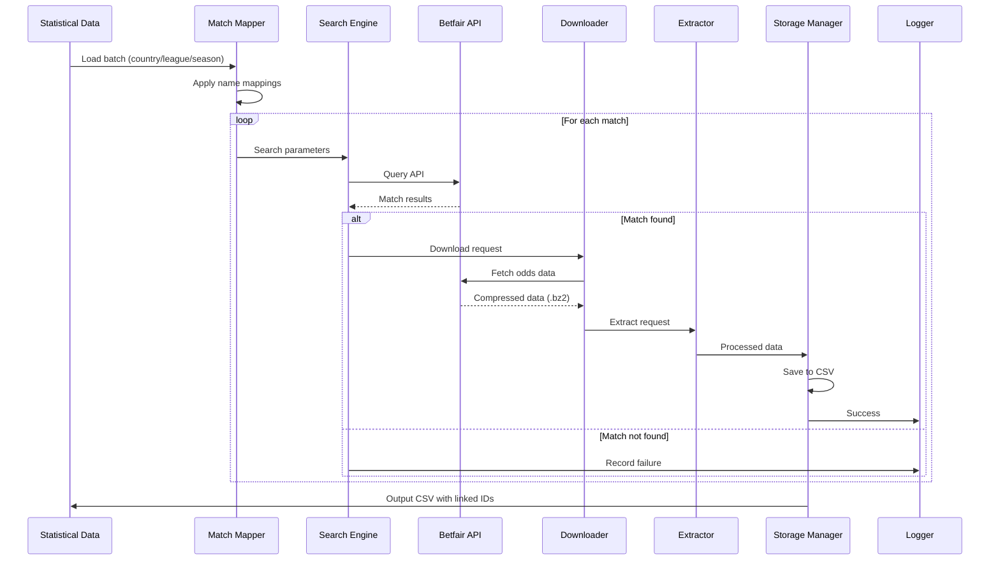

# Football Betting Data Infrastructure - Technical Design Document

## Table of Contents
1. [System Overview](#1-system-overview)
2. [Architecture Design](#2-architecture-design)
3. [Module Specifications](#3-module-specifications)
4. [Data Flow & Processing Pipeline](#4-data-flow--processing-pipeline)
5. [Name Mapping System](#5-name-mapping-system)
6. [Error Handling & Logging Strategy](#6-error-handling--logging-strategy)
7. [Implementation Guide](#7-implementation-guide)
8. [Debugging Tools](#8-debugging-tools)
9. [Configuration Management](#9-configuration-management)

---

## 1. System Overview

### 1.1 Purpose
This system integrates football match statistics with Betfair betting odds data, processing batches of matches organized by country/league/season. The pipeline searches for matches on Betfair, downloads odds data, extracts relevant information, and outputs consolidated CSV files linking statistical match IDs with odds data.

### 1.2 Key Features
- **Batch Processing**: Process matches by country/league/season
- **Intelligent Name Mapping**: Convert team slugs to Betfair names with country-specific mappings
- **Fault Tolerance**: Continue processing on individual match failures
- **Comprehensive Logging**: Track failures at each pipeline stage for manual debugging
- **Parallel Processing**: Optimize throughput with concurrent operations
- **Resource Management**: Automatic cleanup of temporary files

### 1.3 Data Volume Expectations
- **Typical Batch**: 200-500 matches per league season
- **Countries**: Multiple countries processed independently
- **Leagues per Country**: 2-5 leagues
- **Seasons**: Historical data spanning multiple seasons

---

## 2. Architecture Design

### 2.1 High-Level Architecture

```
┌─────────────────────────────────────────────────────────────────┐
│                         INPUT LAYER                             │
├──────────────────────────┬──────────────────────────────────────┤
│  Statistical Data (CSV)  │   Team Mapping (JSON)                │
│  - tournament_id         │   - Country-specific mappings        │
│  - match_id              │   - Slug to Betfair name             │
│  - team_slugs            │   - Name variations                  │
│  - match_date            │                                      │
└───────────────┬──────────┴───────────────────────────┬──────────┘
                │                                       │
                ▼                                       ▼
┌─────────────────────────────────────────────────────────────────┐
│                      PROCESSING PIPELINE                         │
├─────────────────────────────────────────────────────────────────┤
│  ┌──────────────┐  ┌──────────────┐  ┌──────────────┐         │
│  │ Match Mapper │──▶│Search Engine │──▶│  Downloader  │         │
│  └──────────────┘  └──────────────┘  └──────────────┘         │
│         │                  │                  │                 │
│         ▼                  ▼                  ▼                 │
│  ┌──────────────┐  ┌──────────────┐  ┌──────────────┐         │
│  │   Logging    │  │   Caching    │  │   Extractor  │         │
│  └──────────────┘  └──────────────┘  └──────────────┘         │
│                                              │                  │
│                                              ▼                  │
│                                     ┌──────────────┐           │
│                                     │Storage Manager│           │
│                                     └──────────────┘           │
└─────────────────────────────────────────┬───────────────────────┘
                                          │
                                          ▼
┌─────────────────────────────────────────────────────────────────┐
│                         OUTPUT LAYER                             │
├───────────────────────────┬───────────────────────────────────────┤
│   Consolidated CSV        │   Processing Logs                    │
│   - statistical_match_id  │   - Success/failure records         │
│   - betfair_match_id      │   - Debug information               │
│   - odds_data             │   - Name mapping issues             │
└───────────────────────────┴───────────────────────────────────────┘
```

### 2.2 Component Interaction Diagram



---

## 3. Module Specifications

### 3.1 Match Mapper Module

**Purpose**: Transform statistical match data into Betfair-searchable parameters

```python
class MatchMapper:
    """
    Converts statistical match data to Betfair search parameters
    using country-specific team name mappings
    """
    
    def __init__(self, country: str, mapping_dir: str = "./mappings"):
        self.country = country
        self.team_mappings = self._load_country_mappings(country)
        self.failed_mappings = []
        
    def map_match(self, stats_match: Dict) -> Optional[BetfairSearchParams]:
        """
        Map a single statistical match to Betfair search parameters
        
        Args:
            stats_match: Dict with keys:
                - home_team_slug: str
                - away_team_slug: str
                - match_date: datetime
                - tournament_slug: str
                
        Returns:
            BetfairSearchParams or None if mapping fails
        """
        
    def batch_map_matches(self, 
                         stats_df: pd.DataFrame) -> Generator[MappedMatch, None, None]:
        """
        Process entire dataframe of matches
        Yields MappedMatch objects with both stat and betfair IDs
        """
        
    def get_mapping_report(self) -> Dict:
        """
        Return summary of successful and failed mappings
        for manual review and debugging
        """
```

### 3.2 Search Engine Module

**Purpose**: Intelligent match searching with fallback strategies

```python
class BetfairSearchEngine:
    """
    Searches for matches on Betfair with multiple strategies
    """
    
    def __init__(self, api_client: BetfairClient):
        self.client = api_client
        self.search_cache = {}
        self.search_strategies = [
            ExactDateTeamSearch(),
            ExpandedDateSearch(days=2),
            FuzzyTeamNameSearch(threshold=0.85),
            ManualMappingSearch()
        ]
        
    def search_match(self, 
                    params: BetfairSearchParams,
                    use_cache: bool = True) -> SearchResult:
        """
        Search for a match using multiple strategies
        
        Returns:
            SearchResult with:
                - match_id: Optional[str]
                - confidence: float (0-1)
                - strategy_used: str
                - search_attempts: List[SearchAttempt]
        """
        
    def bulk_search(self, 
                   params_list: List[BetfairSearchParams]) -> List[SearchResult]:
        """
        Efficiently search for multiple matches
        Uses caching and rate limiting
        """
```

### 3.3 Pipeline Coordinator

**Purpose**: Orchestrate the entire processing pipeline

```python
class PipelineCoordinator:
    """
    Manages the end-to-end processing pipeline
    """
    
    def __init__(self, config: PipelineConfig):
        self.config = config
        self.mapper = MatchMapper(config.country)
        self.search_engine = BetfairSearchEngine(config.api_client)
        self.downloader = EnhancedDownloader(config.api_client)
        self.extractor = MatchExtractor(config.temp_dir)
        self.storage = StorageManager(config.output_dir)
        self.logger = PipelineLogger(config.log_dir)
        
    def process_batch(self, 
                     stats_file: str,
                     output_file: str) -> ProcessingReport:
        """
        Process entire batch of matches from stats file
        
        Args:
            stats_file: Path to CSV with statistical data
            output_file: Path for output CSV
            
        Returns:
            ProcessingReport with statistics and failure details
        """
        
    def process_country_season(self,
                              country: str,
                              league: str,
                              season: str) -> ProcessingReport:
        """
        Process specific country/league/season combination
        """
```

### 3.4 Storage Manager

**Purpose**: Handle all file operations and cleanup

```python
class StorageManager:
    """
    Manages temporary files, output generation, and cleanup
    """
    
    def __init__(self, output_dir: str, temp_dir: Optional[str] = None):
        self.output_dir = Path(output_dir)
        self.temp_dir = Path(temp_dir or tempfile.mkdtemp())
        self.active_files = {}
        
    def save_match_odds(self, 
                       match_id: str,
                       odds_data: pd.DataFrame,
                       metadata: Dict) -> Path:
        """
        Save processed odds data for a match
        """
        
    def consolidate_batch(self,
                         matches: List[ProcessedMatch],
                         output_path: str) -> None:
        """
        Combine all match data into single CSV
        Links statistical IDs with Betfair data
        """
        
    def cleanup_temp_files(self, match_id: str) -> None:
        """
        Remove temporary files after successful processing
        """
        
    @contextmanager
    def temp_storage_context(self, match_id: str):
        """
        Context manager for automatic cleanup
        """
```

---

## 4. Data Flow & Processing Pipeline

### 4.1 Pipeline Stages

```
Stage 1: Data Loading
├── Load statistical CSV for country/league/season
├── Validate required columns exist
└── Load country-specific team mappings

Stage 2: Match Mapping
├── Convert team slugs to searchable names
├── Parse and standardize dates
├── Generate search parameters
└── Log unmapped teams

Stage 3: Betfair Search
├── Primary: Exact date + team names
├── Fallback 1: Date range ±1 day
├── Fallback 2: Fuzzy team matching
├── Fallback 3: Manual mapping lookup
└── Cache successful searches

Stage 4: Data Download
├── Queue download requests
├── Download .bz2 files to temp storage
├── Validate file integrity
└── Retry failed downloads (max 3)

Stage 5: Data Extraction
├── Decompress .bz2 files
├── Extract odds time series
├── Process market types (MATCH_ODDS, OVER_UNDER, etc.)
└── Clean and normalize data

Stage 6: Storage & Output
├── Link statistical match_id with betfair_match_id
├── Merge odds data with match metadata
├── Generate consolidated CSV
├── Clean up temporary files
└── Update processing logs
```

### 4.2 Parallel Processing Strategy

```python
# Optimal thread allocation based on bottlenecks
THREAD_CONFIG = {
    'search': 3,      # Limited by API rate limits
    'download': 8,    # Network I/O bound
    'extract': 4,     # CPU bound
    'storage': 1      # Sequential to avoid conflicts
}

class ParallelPipeline:
    """
    Implements parallel processing with proper resource management
    """
    
    def __init__(self, thread_config: Dict[str, int]):
        self.executors = {
            stage: ThreadPoolExecutor(max_workers=workers)
            for stage, workers in thread_config.items()
        }
        self.queues = {
            'search': Queue(maxsize=100),
            'download': Queue(maxsize=50),
            'extract': Queue(maxsize=50),
            'storage': Queue(maxsize=20)
        }
```

---

## 5. Name Mapping System

### 5.1 Country-Specific Mapping Structure

```json
// mappings/england.json
{
  "version": "1.0.0",
  "country": "England",
  "last_updated": "2024-01-15",
  "leagues": {
    "premier-league": {
      "arsenal": {
        "betfair_names": ["Arsenal", "Arsenal FC"],
        "variations": ["The Gunners", "AFC"],
        "stadium": "Emirates Stadium"
      },
      "manchester-united": {
        "betfair_names": ["Man Utd", "Manchester United", "Man United"],
        "variations": ["MUFC", "United", "Red Devils"],
        "stadium": "Old Trafford"
      }
    }
  },
  "special_cases": {
    "derbies": {
      "north-london": ["arsenal", "tottenham-hotspur"],
      "manchester": ["manchester-united", "manchester-city"]
    }
  }
}
```

### 5.2 Mapping Management Tools

```python
class MappingManager:
    """
    Tools for managing and debugging team name mappings
    """
    
    def __init__(self, mappings_dir: str = "./mappings"):
        self.mappings_dir = Path(mappings_dir)
        self.mappings = self._load_all_mappings()
        
    def add_mapping(self, 
                   country: str,
                   slug: str,
                   betfair_name: str,
                   league: Optional[str] = None) -> None:
        """
        Add new team name mapping
        """
        
    def find_similar_teams(self,
                          team_name: str,
                          country: str,
                          threshold: float = 0.7) -> List[SimilarTeam]:
        """
        Find potentially matching teams using fuzzy matching
        Returns list of candidates for manual review
        """
        
    def export_unmapped_teams(self, 
                             country: str) -> pd.DataFrame:
        """
        Export all teams that couldn't be mapped
        for manual review and mapping
        """
        
    def validate_mappings(self, country: str) -> ValidationReport:
        """
        Check for conflicts, duplicates, and missing mappings
        """
```

### 5.3 Interactive Mapping Tool

```python
class InteractiveMappingTool:
    """
    CLI tool for manually resolving mapping issues
    """
    
    def run_interactive_session(self, 
                               unmapped_teams: List[str],
                               country: str) -> None:
        """
        Present unmapped teams and suggestions for manual selection
        
        Example interaction:
        > Unmapped team: 'manchester-utd'
        > Suggestions:
        >   1. Man Utd (confidence: 0.92)
        >   2. Manchester United (confidence: 0.88)
        >   3. Man United (confidence: 0.85)
        >   4. Enter custom mapping
        >   5. Skip this team
        > Select option [1-5]: 
        """
```

---

## 6. Error Handling & Logging Strategy

### 6.1 Logging Architecture

```python
class PipelineLogger:
    """
    Comprehensive logging for all pipeline stages
    """
    
    def __init__(self, log_dir: str):
        self.log_dir = Path(log_dir)
        self.loggers = {
            'main': self._setup_logger('pipeline_main.log', logging.INFO),
            'search': self._setup_logger('search_failures.log', logging.WARNING),
            'download': self._setup_logger('download_failures.log', logging.WARNING),
            'extract': self._setup_logger('extraction_errors.log', logging.ERROR),
            'mapping': self._setup_logger('mapping_issues.log', logging.INFO),
            'debug': self._setup_logger('debug.log', logging.DEBUG)
        }
        
    def log_search_failure(self, 
                          match: Dict,
                          attempts: List[SearchAttempt]) -> None:
        """
        Log detailed search failure for manual debugging
        """
        
    def log_processing_summary(self, 
                              report: ProcessingReport) -> None:
        """
        Log batch processing summary with statistics
        """
```

### 6.2 Error Recovery Strategies

```python
class ErrorRecoveryStrategy:
    """
    Define how to handle different types of failures
    """
    
    STRATEGIES = {
        'SearchNotFound': {
            'action': 'log_and_continue',
            'log_level': 'warning',
            'retry_count': 0,
            'manual_review': True
        },
        'DownloadTimeout': {
            'action': 'retry_with_backoff',
            'log_level': 'warning',
            'retry_count': 3,
            'backoff_seconds': [5, 15, 30]
        },
        'ExtractionError': {
            'action': 'log_and_continue',
            'log_level': 'error',
            'save_raw_file': True,
            'manual_review': True
        },
        'MappingFailure': {
            'action': 'use_fuzzy_match',
            'log_level': 'info',
            'fallback_threshold': 0.75,
            'manual_review': True
        }
    }
```

### 6.3 Processing Report Format

```python
@dataclass
class ProcessingReport:
    """
    Comprehensive report for batch processing
    """
    batch_id: str
    country: str
    league: str
    season: str
    start_time: datetime
    end_time: datetime
    
    # Statistics
    total_matches: int
    successful_matches: int
    failed_searches: int
    failed_downloads: int
    failed_extractions: int
    
    # Detailed failures
    search_failures: List[SearchFailure]
    download_failures: List[DownloadFailure]
    extraction_failures: List[ExtractionFailure]
    mapping_issues: List[MappingIssue]
    
    # Output
    output_file: str
    log_files: List[str]
    
    def generate_summary(self) -> str:
        """Generate human-readable summary"""
        
    def export_failures_csv(self, path: str) -> None:
        """Export all failures to CSV for review"""
```

---

## 7. Implementation Guide

### 7.1 Project Structure

```
football-betting-pipeline/
├── src/
│   ├── __init__.py
│   ├── core/
│   │   ├── __init__.py
│   │   ├── config.py
│   │   ├── exceptions.py
│   │   └── models.py
│   ├── mappers/
│   │   ├── __init__.py
│   │   ├── match_mapper.py
│   │   ├── name_mapper.py
│   │   └── mapping_manager.py
│   ├── betfair/
│   │   ├── __init__.py
│   │   ├── search_engine.py
│   │   ├── downloader.py
│   │   └── api_client.py
│   ├── extractors/
│   │   ├── __init__.py
│   │   ├── match_extractor.py
│   │   ├── odds_processor.py
│   │   └── market_processors/
│   ├── storage/
│   │   ├── __init__.py
│   │   ├── storage_manager.py
│   │   ├── temp_manager.py
│   │   └── csv_writer.py
│   ├── pipeline/
│   │   ├── __init__.py
│   │   ├── coordinator.py
│   │   ├── parallel_processor.py
│   │   └── error_handler.py
│   └── utils/
│       ├── __init__.py
│       ├── logging_config.py
│       ├── fuzzy_matching.py
│       └── date_helpers.py
├── mappings/
│   ├── england.json
│   ├── scotland.json
│   └── spain.json
├── config/
│   ├── pipeline_config.yaml
│   └── logging_config.yaml
├── logs/
├── temp/
├── output/
├── scripts/
│   ├── process_country.py
│   ├── update_mappings.py
│   └── debug_failures.py
├── tests/
├── requirements.txt
└── README.md
```

### 7.2 Implementation Order

1. **Phase 1: Core Infrastructure** (Week 1-2)
   - Set up project structure
   - Implement configuration management
   - Create logging system
   - Define data models

2. **Phase 2: Mapping System** (Week 2-3)
   - Build MappingManager
   - Create country-specific JSON files
   - Implement fuzzy matching
   - Build interactive mapping tool

3. **Phase 3: Search & Download** (Week 3-4)
   - Refactor existing BetfairDownloader
   - Implement SearchEngine with strategies
   - Add caching layer
   - Create retry logic

4. **Phase 4: Extraction & Storage** (Week 4-5)
   - Refactor existing extractors
   - Implement StorageManager
   - Add temp file management
   - Create CSV output generation

5. **Phase 5: Pipeline Integration** (Week 5-6)
   - Build PipelineCoordinator
   - Implement parallel processing
   - Add error recovery
   - Create processing reports

6. **Phase 6: Testing & Optimization** (Week 6-7)
   - Unit tests for each module
   - Integration tests
   - Performance optimization
   - Documentation

### 7.3 Usage Examples

```python
# Example 1: Process a single country/league/season
from pipeline import PipelineCoordinator
from core.config import PipelineConfig

config = PipelineConfig(
    country="england",
    league="premier-league",
    season="2023-2024",
    parallel_processing=True,
    cleanup_temp_files=True
)

coordinator = PipelineCoordinator(config)
report = coordinator.process_country_season(
    country="england",
    league="premier-league",
    season="2023-2024"
)

print(report.generate_summary())

# Example 2: Process with custom error handling
from pipeline.error_handler import CustomErrorHandler

error_handler = CustomErrorHandler(
    continue_on_search_failure=True,
    max_retry_attempts=5,
    save_failed_matches=True
)

coordinator = PipelineCoordinator(config, error_handler=error_handler)
report = coordinator.process_batch(
    stats_file="data/england_premier_league_2023.csv",
    output_file="output/england_pl_2023_with_odds.csv"
)

# Example 3: Debug failed matches
from utils.debug_tools import FailureDebugger

debugger = FailureDebugger(report.search_failures)
debugger.interactive_resolve()
```

---

## 8. Debugging Tools

### 8.1 Match Search Debugger

```python
class SearchDebugger:
    """
    Interactive tool for debugging search failures
    """
    
    def debug_match(self, 
                   stats_match: Dict,
                   verbose: bool = True) -> None:
        """
        Step through search process with detailed output
        
        Output example:
        ========================================
        Debugging match: Arsenal vs Chelsea (2023-09-15)
        ========================================
        
        Step 1: Name Mapping
        - Input: arsenal -> Output: Arsenal
        - Input: chelsea -> Output: Chelsea
        
        Step 2: Date Processing
        - Input: 2023-09-15 15:00:00
        - Search window: 2023-09-14 to 2023-09-16
        
        Step 3: API Search
        - Query: event_name=['Arsenal v Chelsea', 'Chelsea v Arsenal']
        - Date range: 2023-09-14 to 2023-09-16
        - Results: 0 matches found
        
        Step 4: Fuzzy Search
        - Expanding search...
        - Found: 'Arsenal FC v Chelsea FC' (confidence: 0.89)
        
        Recommendation: Add mapping 'Arsenal' -> 'Arsenal FC'
        """
```

### 8.2 Data Validation Tools

```python
class DataValidator:
    """
    Validate data at each pipeline stage
    """
    
    def validate_input_csv(self, file_path: str) -> ValidationResult:
        """Check input CSV has required columns and valid data"""
        
    def validate_mappings(self, country: str) -> ValidationResult:
        """Check mapping file completeness and conflicts"""
        
    def validate_output_csv(self, file_path: str) -> ValidationResult:
        """Verify output CSV has all expected data"""
        
    def generate_validation_report(self) -> str:
        """Create comprehensive validation report"""
```

### 8.3 Performance Profiler

```python
class PipelineProfiler:
    """
    Profile pipeline performance to identify bottlenecks
    """
    
    def profile_batch(self, 
                     stats_file: str,
                     sample_size: int = 10) -> ProfilingReport:
        """
        Profile pipeline with sample matches
        
        Returns timing for each stage:
        - Mapping: avg 0.05s per match
        - Search: avg 2.3s per match (bottleneck)
        - Download: avg 1.8s per match
        - Extract: avg 0.3s per match
        - Storage: avg 0.1s per match
        
        Recommendations:
        - Increase search cache hit rate
        - Batch API requests where possible
        """
```

---

## 9. Configuration Management

### 9.1 Main Configuration File

```yaml
# config/pipeline_config.yaml

pipeline:
  version: "1.0.0"
  environment: "production"

api:
  betfair:
    rate_limit: 20  # requests per second
    timeout: 30
    max_retries: 3
    backoff_factor: 2

processing:
  parallel:
    enabled: true
    max_workers:
      search: 3
      download: 8
      extract: 4
      storage: 1
  batch_size: 100
  memory_limit_mb: 2048

storage:
  temp_dir: "./temp"
  output_dir: "./output"
  log_dir: "./logs"
  cleanup_on_success: true
  compression: "gzip"

mapping:
  dir: "./mappings"
  fuzzy_threshold: 0.85
  cache_enabled: true
  cache_ttl_hours: 24

logging:
  level: "INFO"
  format: "%(asctime)s - %(name)s - %(levelname)s - %(message)s"
  rotation:
    enabled: true
    max_bytes: 10485760  # 10MB
    backup_count: 5

error_handling:
  continue_on_failure: true
  save_failed_matches: true
  failed_matches_dir: "./failed"
```

### 9.2 Environment-Specific Configs

```python
class ConfigManager:
    """
    Manage different configurations for dev/test/prod
    """
    
    def __init__(self, environment: str = "development"):
        self.environment = environment
        self.config = self._load_config(environment)
        
    def _load_config(self, env: str) -> Dict:
        """Load environment-specific configuration"""
        base_config = self._load_yaml("config/base.yaml")
        env_config = self._load_yaml(f"config/{env}.yaml")
        return self._merge_configs(base_config, env_config)
        
    def get(self, key: str, default: Any = None) -> Any:
        """Get configuration value with dot notation
        Example: config.get('api.betfair.timeout', 30)
        """
```

---

## Appendix A: Data Models

```python
# Core data models used throughout the pipeline

@dataclass
class StatisticalMatch:
    """Input match from statistical data"""
    tournament_id: str
    season_id: str
    match_id: str
    tournament_slug: str
    home_team_slug: str
    away_team_slug: str
    match_date: datetime
    
@dataclass
class BetfairSearchParams:
    """Parameters for searching Betfair"""
    home_team: str
    away_team: str
    date_from: datetime
    date_to: datetime
    country: str
    competition: Optional[str] = None
    
@dataclass
class ProcessedMatch:
    """Final processed match with all data"""
    statistical_match_id: str
    betfair_match_id: Optional[str]
    home_team: str
    away_team: str
    match_date: datetime
    odds_data: Optional[pd.DataFrame]
    processing_status: str
    error_message: Optional[str] = None
```

## Appendix B: Troubleshooting Guide

### Common Issues and Solutions

1. **Match Not Found**
   - Check team name mappings
   - Verify date is correct
   - Try wider date search window
   - Check if match was postponed/cancelled

2. **Download Timeouts**
   - Check network connection
   - Verify API credentials
   - Reduce parallel downloads
   - Implement exponential backoff

3. **Extraction Failures**
   - Verify .bz2 file integrity
   - Check temp storage space
   - Review market type processor
   - Save raw file for debugging

4. **Memory Issues**
   - Reduce batch size
   - Implement streaming processing
   - Clear cache more frequently
   - Use disk-based queue for large batches

---

## Version History

- **v1.0.0** (2024-01-15): Initial design document
- **v1.0.1** (pending): Add streaming support for large batches
- **v1.1.0** (planned): Add real-time odds monitoring
